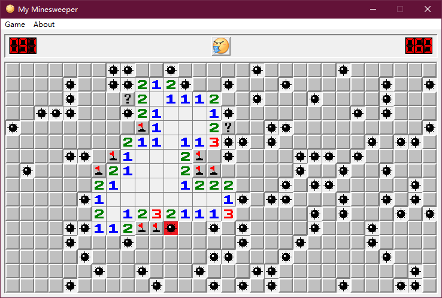

# My_Minesweeper

This repository is a **rebuild** of the classical minesweeper game `winmine.exe` with a higher resolution to satisfy a 1080p screen. This program runs on **Windows** and does **NOT** support cross-platform.

This repository is a project of **Visual Studio 2022**. To open this project in **VS**, just double click on the solution file `My_Minesweeper.sln`.

Uses emojis from Baidu Tieba.

## Features

- Larger window size for 1080p screen.
- Same UI design and operations as `winmine.exe`.
- Support **Windows 10** by default.

## Directory Structure

- `res/`:
  Contains resources that are used in the program.

- `src/`:
  Contains the source code of the program.

## License

Copyright (C) 2020 Gee Wang.  
Licensed under the [GNU GPL v3](./LICENSE).
