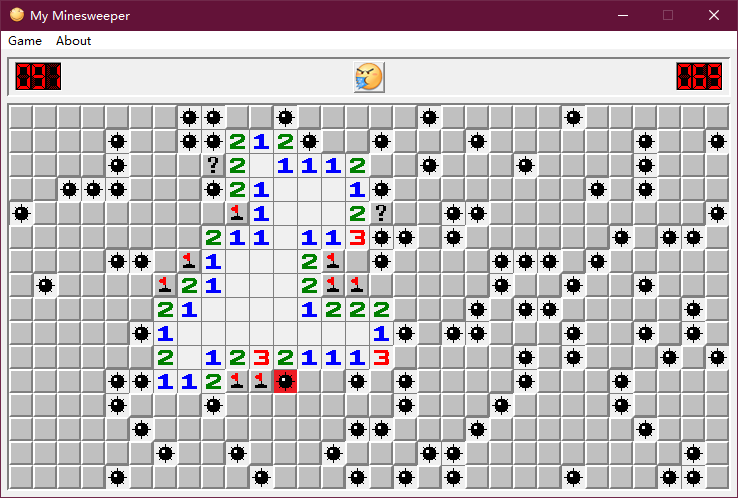

# My Minesweeper

This repository is a **rebuild** of the classic Minesweeper game `winmine.exe`, redesigned for 1080p resolution. It is implemented entirely in **C** using the **Win32 GDI** API.

The release targets **Windows only** and does not support cross‑platform execution.

Emoji assets are sourced from **Baidu Tieba**.

## Features

- Larger window size for 1080p screen.
- Same UI design and operations as `winmine.exe`.
- 100% **C** code and **Win32 GDI**.
- Support **Windows 10** by default.

## License

Copyright (C) 2020 Gee Wang\
Licensed under the [GPLv3](./LICENSE).
